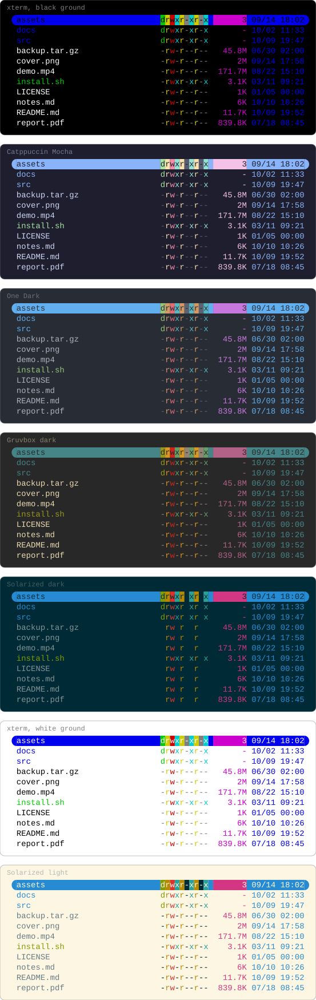
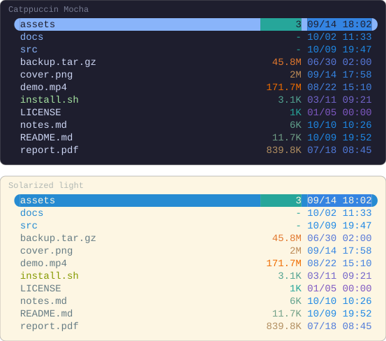

# Examples

Each example is a configuration and what it draws. Every picture here is
rendered by running the configuration above it in Yazi 26.9.1, so the two say
the same thing; Yazi's file icons are switched off for the pictures, since an
image cannot rely on its viewer having a Nerd Font. Each is drawn on a dark
terminal and a light one, Catppuccin Mocha and Solarized light, except where
the terminal is the point.

## On any terminal

A colour written by name — `blue`, `magenta` — is drawn from your terminal's
own palette, the same way Yazi draws a directory or an executable. One capture
of this configuration, drawn in the colours of seven terminal schemes:

```lua
-- ~/.config/yazi/init.lua
require("supaline"):setup {
  linemodes = {
    detail = {
      "permissions",
      { "size", style = "magenta" },
      { "mtime", style = "blue" },
    },
  },
}
```

<!-- drawn on every ground -->


`permissions` takes its colours from your theme's `[status]` section, and
Yazi's preset theme writes those by name as well.

## A gradient

A colour can run from the smallest value in the folder to the largest. `size`
places a file by the magnitude of its size, so a folder of kilobytes and
gigabytes still spreads across the whole gradient; a directory, which has no
size to place, takes the low end.

```lua
-- ~/.config/yazi/init.lua
require("supaline"):setup {
  linemodes = {
    detail = {
      { "size", style = "#26a69a -> #ef6c00" },
      { "mtime", style = "#7e57c2 -> #1e88e5" },
    },
  },
}
```


