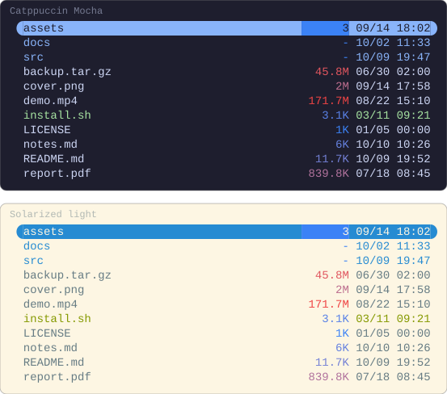
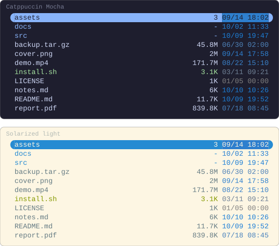

# Examples

Each example is a configuration and what it draws. Every picture here is
rendered by running the configuration above it in Yazi 26.9.1, so the two say
the same thing; Yazi's file icons are switched off for the pictures, since an
image cannot rely on its viewer having a Nerd Font. Each is drawn on a dark
terminal and a light one, Catppuccin Mocha and Solarized light, except where
the terminal is the point.

## On any terminal

A colour written by name — `blue`, `magenta` — is drawn from your terminal's
own palette, the same way Yazi draws a directory or an executable. One capture
of this configuration, drawn in the colours of seven terminal schemes:

```lua
-- ~/.config/yazi/init.lua
require("supaline"):setup {
  linemodes = {
    detail = {
      "permissions",
      { "size", style = "magenta" },
      { "mtime", style = "blue" },
    },
  },
}
```

<!-- drawn on every ground -->


`permissions` takes its colours from your theme's `[status]` section, and
Yazi's preset theme writes those by name as well.

## A gradient on size

A colour can run from the smallest value in the folder to the largest. From
blue to red, the small files are cool and the large ones hot.
`size` places a file by the magnitude of its size, so kilobytes and gigabytes
in one folder still spread across the whole gradient; a directory, which has
no size to place, takes the low end.

```lua
-- ~/.config/yazi/init.lua
require("supaline"):setup {
  linemodes = {
    detail = {
      { "size", style = "#3b82f6 -> #ef4444" },
      "mtime",
    },
  },
}
```



## A gradient on age

The same on `mtime` draws what changed recently hot, and what has sat
untouched for months cool.

```lua
-- ~/.config/yazi/init.lua
require("supaline"):setup {
  linemodes = {
    detail = {
      "size",
      { "mtime", style = "#3b82f6 -> #ef4444" },
    },
  },
}
```


